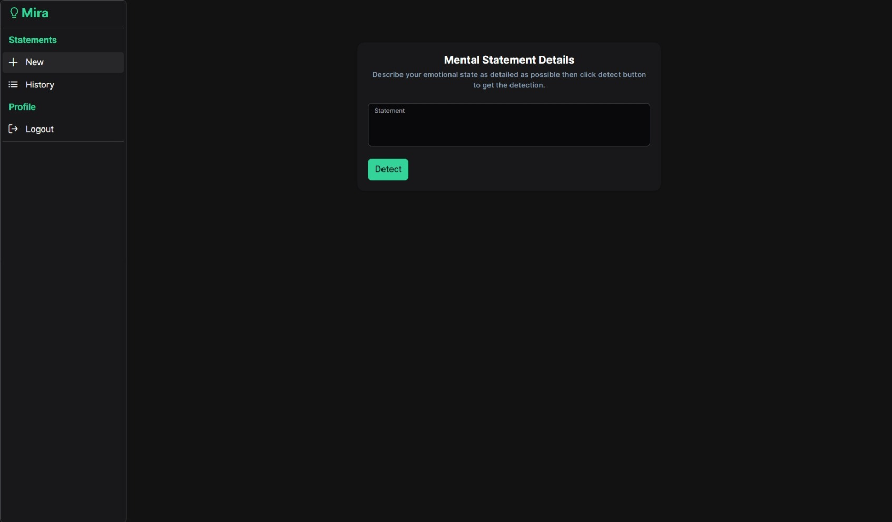
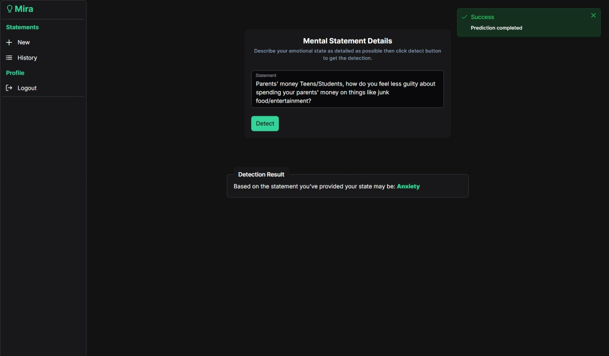
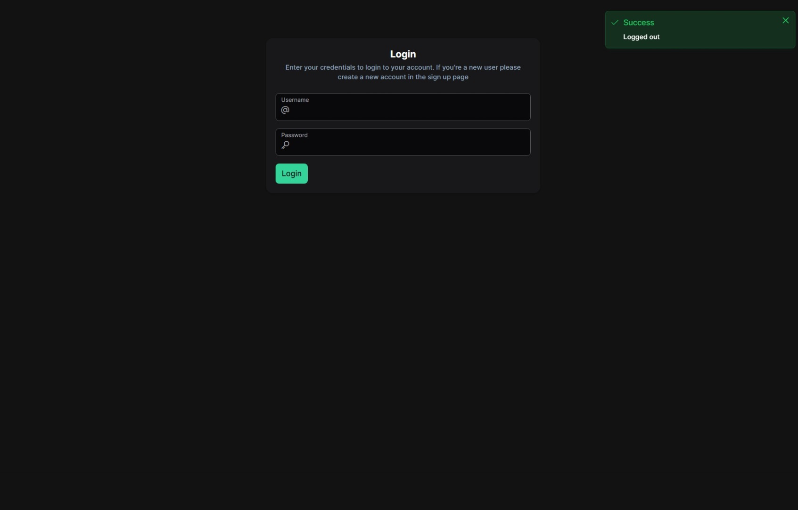
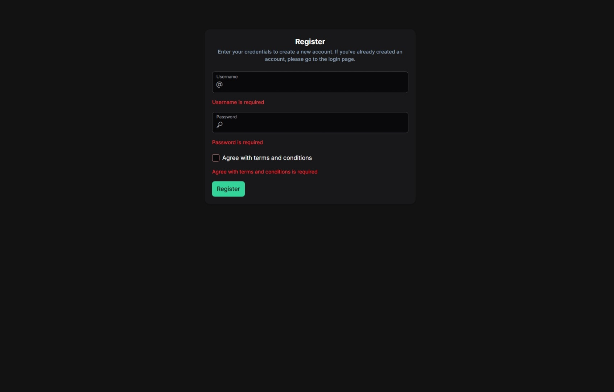
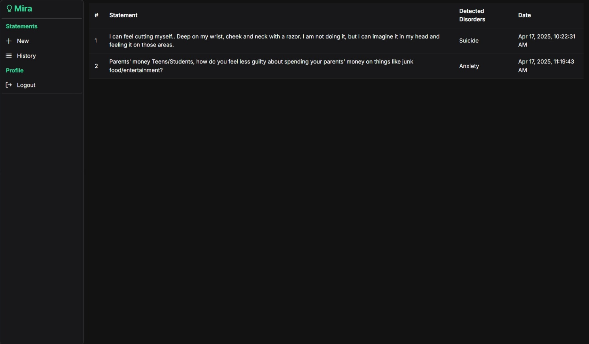

# 🌿 Mira (Frontend)

A modern Angular-based frontend for a mental disorder detection platform, built with scalability and UX in mind. Designed to be modular, performant, and visually consistent using **PrimeNG** and **TailwindCSS**.

---

## ✨ Features

- 🔐 **Protected Routes** — Access control via route guards
- 👥 **Authentication & Authorization** — JWT-based session handling
- 💾 **Local Storage Integration** — Persist sessions securely on the client
- 🧩 **Modular Service Architecture** — Clean, reusable services across the app
- 📝 **Reusable Form Components** — Custom form handling with dynamic configs
- 🧠 **Reactive Angular Forms** — With built-in and custom validations
- 🧭 **Angular Router** — Clean routing with lazy loading and layout switching
- 🎨 **PrimeNG + TailwindCSS** — Powerful UI components and custom styling
- 🧱 **Conditional Layouts** — Switch between layouts based on auth state

---
## 🖼 UI Screenshots








---

## 🚀 Getting Started

### 📦 Install Dependencies

```bash
npm install
```

### ▶️ Start Dev Server

```bash
ng serve
```

Visit: `http://localhost:4200`

---

## 🧪 Testing

```bash
ng test      # Unit tests
ng e2e       # End-to-end (configure your own framework)
```

---

## 🛠️ Code Scaffolding

```bash
ng generate component my-component
ng generate service my-service
```

More options:

```bash
ng generate --help
```

---

## 📦 Build

```bash
ng build
```

Build artifacts will be stored in the `dist/` directory.

---

## 📚 Resources

- [Angular CLI Documentation](https://angular.dev/tools/cli)
- [PrimeNG](https://primeng.org/)
- [TailwindCSS](https://tailwindcss.com/)

---
